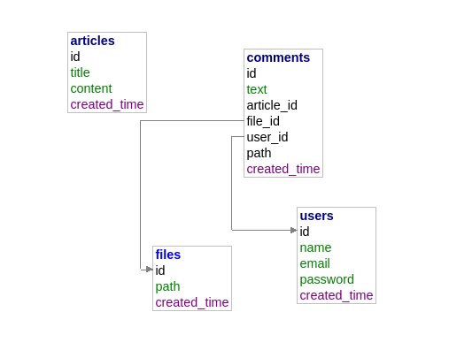
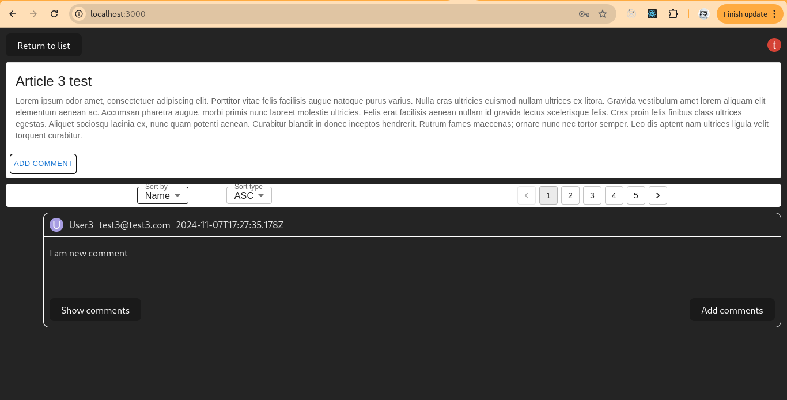

# Main instruction

1. Install Docker
2. Clone this repo
3. Run command - sudo bash starter.sh

Check that all fine if migration not started run it manually:

1. After containers was running run command - sudo docker exec container-server sh -c "npm run migrate"
   this need for creation structure in PG container
2. Run command - sudo docker exec container-server sh -c "npm run seed"
   this need for creation some initial data

3. Go to http://localhost:3000

DB diagram:

Small video

